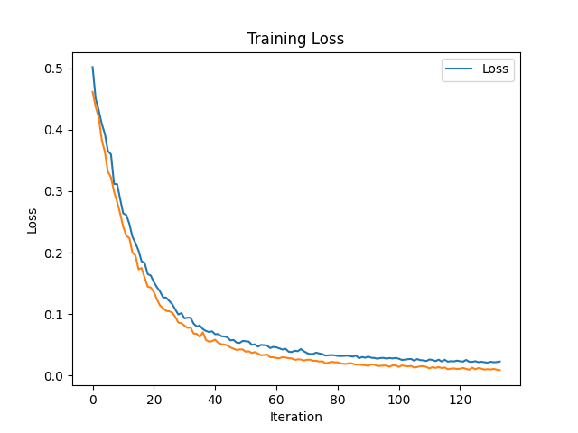
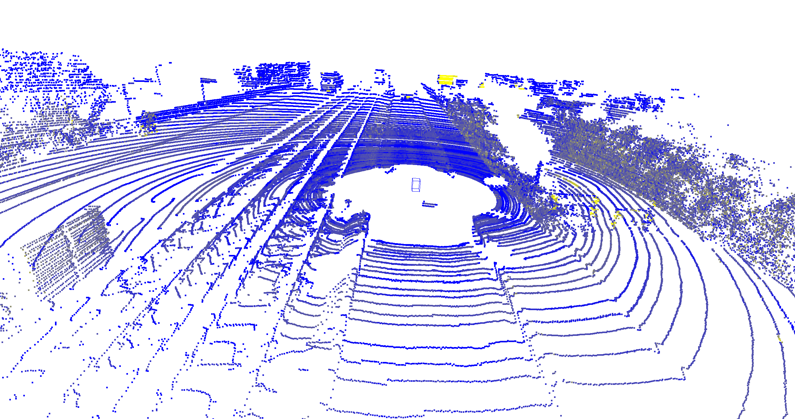

# Multimodal Alignment Model for LiDAR and RGB Data

This repository implements a multimodal alignment model to fuse LiDAR point clouds and RGB images for enhanced perception in autonomous systems. The model leverages pretrained encoders (`PointNet++` and `Vision Transformer`) and a Query-Based Transformer (Q-Former-inspired) for generating unified embeddings across modalities. It also includes a detection head for 2D and 3D object localization.

---

## File Structure

```
Multimodal_Alignment_Model/
├── __pycache__/                 # Cache files
├── kitti_3d_object_detection/   # KITTI-related files (if any)
├── Pointnet_Pointnet2_pytorch/  # PointNet++ library files
├── .gitignore                   # Git ignore file
├── best_model.pth               # Trained weights for alignment model
├── best_model_lightning.pth     # Lightning-trained weights
├── detection_head.pth           # Detection head trained weights
├── detection_head_lightning.pth # Lightning detection head weights
├── detection_training.py        # Detection head training script
├── detection.py                 # Detection head inference
├── model.py                     # Core multimodal alignment model
├── pointnet_loader.py           # KITTI dataset loader
├── training2.py                 # Main training script
├── visualize_detection.py       # Visualization script for detection results
├── viz_detection2.py            # Alternate visualization script
├── train and val loss graphs/   # Training graphs folder
```

---

## Installation

1. Clone the repository:
   ```bash
   git clone https://github.com/your-username/your-repo-name.git
   cd your-repo-name
   ```

2. Install dependencies:
   ```bash
   pip install -r requirements.txt
   ```

3. Install the following repositories for `PointNet++` and KITTI dataset handling:
   - [PointNet++ PyTorch Implementation](https://github.com/erikwijmans/Pointnet2_PyTorch)
   - [KITTI Dataset Loader](https://github.com/kuixu/kitti-dataset)

---

## Usage

### Training the Alignment Model
1. Ensure that the KITTI dataset and the `PointNet++` repository are installed and accessible.
2. Run the alignment model training script:
   ```bash
   python training2.py
   ```

### Running the Detection Head
1. Ensure the alignment model is trained, and the detection head weights are available.
2. Train the detection head:
   ```bash
   python detection_training.py
   ```
3. Visualize results:
   ```bash
   python visualize_detection.py
   ```

---

## Results

1. **Unified Embeddings**:  
   Generated using cosine similarity loss for embedding alignment. Training experiments demonstrated the effectiveness of:
   - **Regularization**: Prevented overfitting.
   - **Dropout**: Improved generalization.  
   Validation losses steadily converged, ensuring robust embeddings.

2. **Detection Results**:  
   Bounding boxes are available for both 2D (images) and 3D (LiDAR point clouds):
   - 2D bounding boxes visualized on RGB images.
   - 3D bounding boxes visualized in LiDAR point cloud data.

   **Example Results:**
   - 2D Bounding Boxes:  
     
   - 3D Bounding Boxes:  
     

---

## Future Work

- Optimize the detection head for improved accuracy.
- Extend the model for real-time applications in autonomous systems.
- Explore additional datasets to validate performance across diverse scenarios.

---

## Contributor

- **Vijay Chevireddi** - creddy@umd.edu
